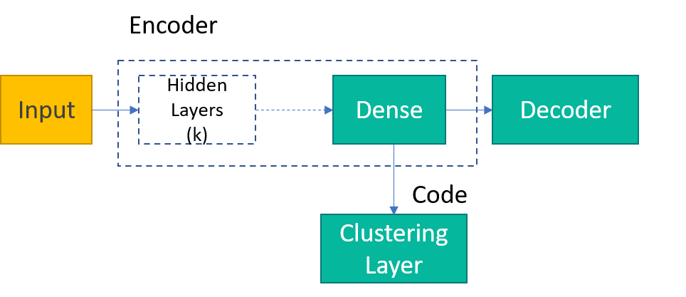
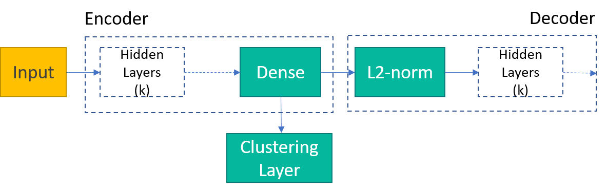
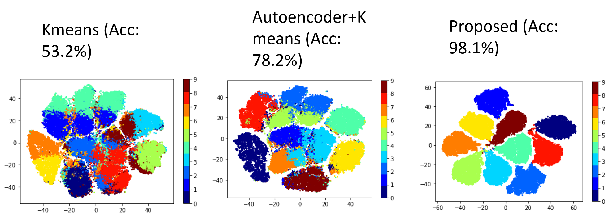

# Deep clustering with L2 norm

Inspired by the [Deep Convolutional Embedded Clustering (DCEC)](https://xifengguo.github.io/papers/ICONIP17-DCEC.pdf) algorithm,, the dense embeddings (encoded representations from dense layer) is sent to the clustering layer for iterative optimisation. 

   

Unlike their work, we normalise the representations (output of the dense layer) before feeding to other hidden layers in the decoder.

## Results

t-SNE visualisations of discriminative representations for MNIST dataset with accuracy in (a) original feature space, (b) Autoencoder latent space and (c) Autoencoder latent space with proposed approach

## References

[1] Ndubuaku, M., Anjum, A. and Liotta, A., 2019, October. Cloud-assisted Adaptive Stream Processing from Discriminative Representations. In 2019 IEEE International Conference on Systems, Man and Cybernetics (SMC) (pp. 164-169). IEEE.
